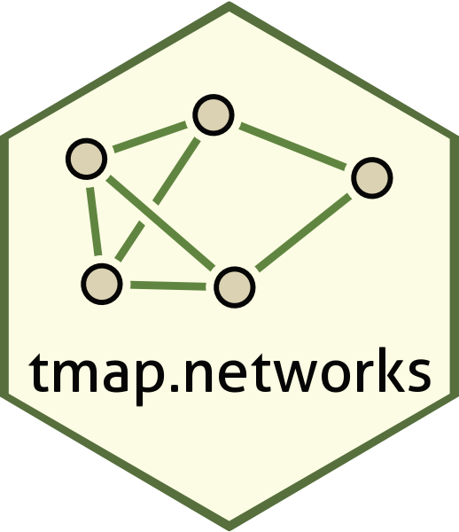

# tmap.networks: network layers in tmap 

[tmap](https://r-tmap.github.io/tmap/) is a R package for visualizing
spatial data. This package is an extension. It features native support
for `sfnetwork` objects (from the package
[sfnetworks](https://luukvdmeer.github.io/sfnetworks/index.html)), and
features network specific layer functions

## Installation

This package is in development so the development version of both
**tmap** and **tmap.networks** are required.

### tmap

``` r
# install.packages("remotes")
remotes::install_github("r-tmap/tmap")

# install.packages("pak")
pak::pak("r-tmap/tmap")

# Or from r-universe
install.packages("tmap", repos = c("https://r-tmap.r-universe.dev", "https://cloud.r-project.org"))
```

For Linux and macOS users who are new to working with spatial data in R,
this may fail since additional (non-R) libraries are required (which are
automatically installed for Windows users).

### tmap.networks

``` r
# install.packages("remotes")
remotes::install_github("r-tmap/tmap.networks")

# install.packages("pak")
pak::pak("r-tmap/tmap.networks")

# Or from r-universe
install.packages("tmap.networks", repos = c("https://r-tmap.r-universe.dev", "https://cloud.r-project.org"))
```
