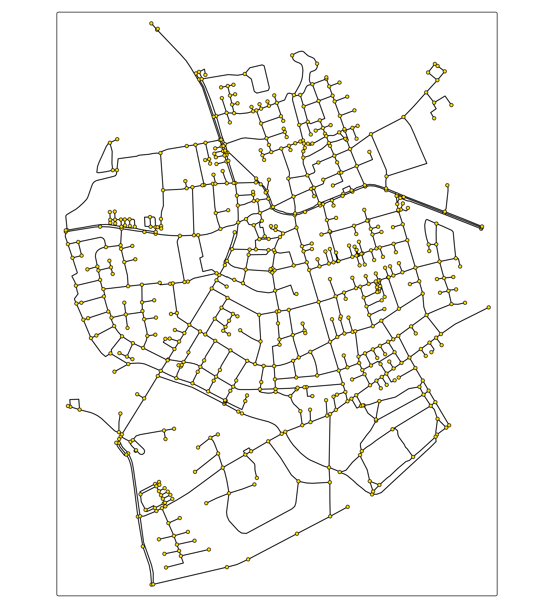
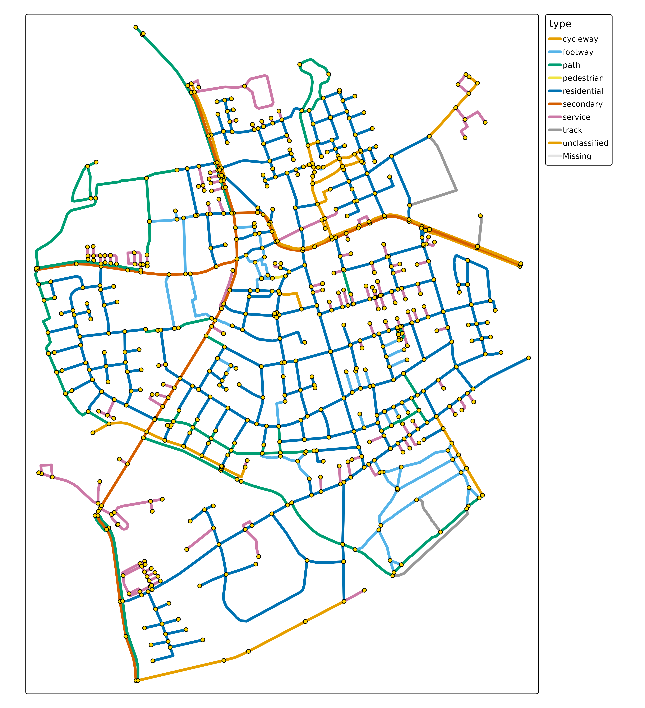

# Introduction

With **tmap.networks** network visualizations can be made. It will
handle `sfnetwork` objects (from the package
[sfnetworks](https://luukvdmeer.github.io/sfnetworks/index.html))
natively.

``` r
library(sfnetworks)
library(tmap.networks)

(sfn = as_sfnetwork(roxel))
#> # A sfnetwork with 701 nodes and 851 edges
#> #
#> # CRS:  EPSG:4326 
#> #
#> # A directed multigraph with 14 components with spatially explicit edges
#> #
#> # Node data: 701 × 1 (active)
#>              geometry
#>           <POINT [°]>
#> 1 (7.533722 51.95556)
#> 2 (7.533461 51.95576)
#> 3 (7.532442 51.95422)
#> 4  (7.53209 51.95328)
#> 5 (7.532709 51.95209)
#> 6 (7.532869 51.95257)
#> # ℹ 695 more rows
#> #
#> # Edge data: 851 × 5
#>    from    to name                  type                                geometry
#>   <int> <int> <chr>                 <fct>                       <LINESTRING [°]>
#> 1     1     2 Havixbecker Strasse   residential (7.533722 51.95556, 7.533461 51…
#> 2     3     4 Pienersallee          secondary   (7.532442 51.95422, 7.53236 51.…
#> 3     5     6 Schulte-Bernd-Strasse residential (7.532709 51.95209, 7.532823 51…
#> # ℹ 848 more rows
```

Besides this new spatial data class `"sfnetwork"`, this package also
features new map layers, albeit very basic so far:

``` r
tm_shape(sfn) +
    tm_network()
```



``` r
tm_shape(sfn) +
    tm_edges(col = "type", lwd = 4) +
    tm_nodes()
```


